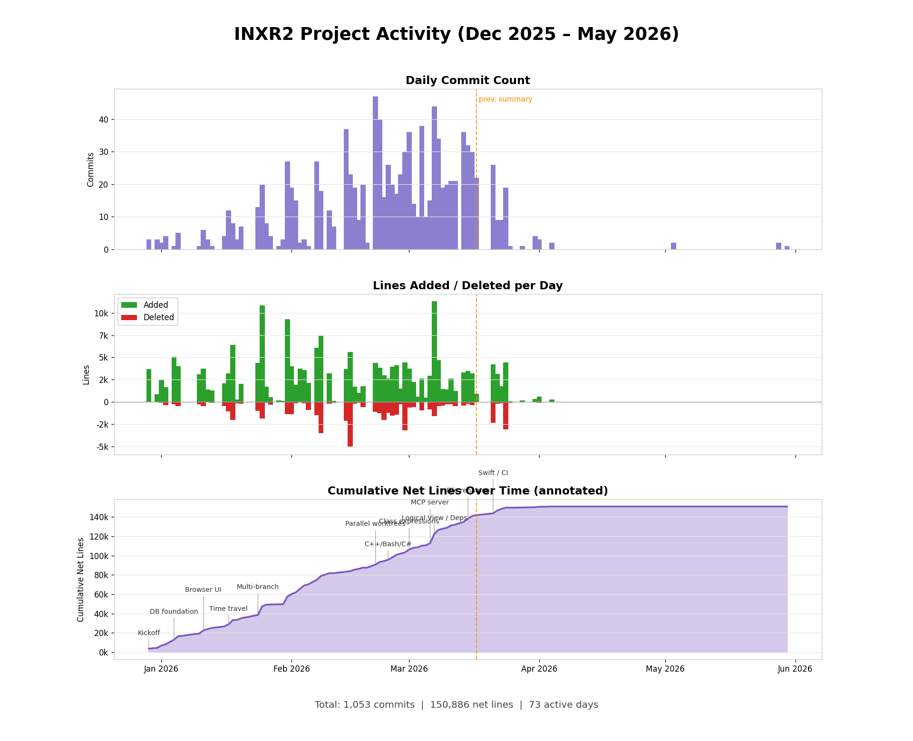

# INXR2 Project Activity Summary

_Line counts exclude generated/vendored files (lock files, images, `dist/`)._

## Commit History by Day

| Date | Commits | Added | Deleted | Net | Notes |
|------|---------|-------|---------|-----|-------|
| 2025-12-29 | 3 | +3,706 | -3 | +3,703 | Project kickoff |
| 2025-12-31 | 3 | +842 | -36 | +806 | |
| 2026-01-01 | 2 | +2,481 | -88 | +2,393 | |
| 2026-01-02 | 4 | +1,650 | -386 | +1,264 | |
| 2026-01-04 | 1 | +5,080 | -279 | +4,801 | DB foundation |
| 2026-01-05 | 5 | +3,999 | -455 | +3,544 | File indexing |
| 2026-01-10 | 1 | +3,111 | -286 | +2,825 | CLI engine |
| 2026-01-11 | 6 | +3,764 | -491 | +3,273 | Browser UI |
| 2026-01-12 | 3 | +1,386 | -42 | +1,344 | |
| 2026-01-13 | 1 | +1,281 | -121 | +1,160 | Config system |
| 2026-01-16 | 4 | +2,099 | -468 | +1,631 | |
| 2026-01-17 | 12 | +3,228 | -1,075 | +2,153 | Time travel |
| 2026-01-18 | 8 | +6,417 | -2,029 | +4,388 | |
| 2026-01-19 | 3 | +259 | -132 | +127 | |
| 2026-01-20 | 7 | +2,025 | -224 | +1,801 | URL state |
| 2026-01-24 | 13 | +4,360 | -1,000 | +3,360 | Multi-branch |
| 2026-01-25 | 20 | +10,849 | -1,853 | +8,996 | |
| 2026-01-26 | 8 | +1,729 | -92 | +1,637 | |
| 2026-01-27 | 4 | +542 | -309 | +233 | |
| 2026-01-29 | 1 | +186 | -6 | +180 | |
| 2026-01-30 | 3 | +107 | -28 | +79 | |
| 2026-01-31 | 27 | +9,309 | -1,407 | +7,902 | |
| 2026-02-01 | 19 | +3,983 | -1,397 | +2,586 | |
| 2026-02-02 | 15 | +8,771 | -170 | +8,601 | |
| 2026-02-03 | 2 | +3,765 | -10 | +3,755 | Free-text search |
| 2026-02-04 | 3 | +3,581 | -134 | +3,447 | |
| 2026-02-05 | 1 | +2,118 | -926 | +1,192 | |
| 2026-02-07 | 27 | +6,115 | -1,481 | +4,634 | |
| 2026-02-08 | 18 | +7,494 | -3,520 | +3,974 | |
| 2026-02-10 | 12 | +3,195 | -198 | +2,997 | |
| 2026-02-11 | 7 | +92 | -124 | -32 | Net-negative day (cleanup) |
| 2026-02-14 | 37 | +3,697 | -2,125 | +1,572 | |
| 2026-02-15 | 23 | +7,146 | -5,131 | +2,015 | |
| 2026-02-16 | 19 | +1,688 | -233 | +1,455 | |
| 2026-02-17 | 9 | +1,042 | -126 | +916 | |
| 2026-02-18 | 20 | +1,774 | -574 | +1,200 | |
| 2026-02-19 | 2 | +5 | -1 | +4 | |
| 2026-02-21 | 47 | +4,536 | -1,298 | +3,238 | Parallel worktrees — most commits/day |
| 2026-02-22 | 40 | +3,836 | -1,251 | +2,585 | |
| 2026-02-23 | 16 | +2,991 | -2,027 | +964 | |
| 2026-02-24 | 26 | +2,642 | -1,226 | +1,416 | C++, Bash, C# support |
| 2026-02-25 | 20 | +4,113 | -1,658 | +2,455 | |
| 2026-02-26 | 17 | +4,122 | -1,434 | +2,688 | |
| 2026-02-27 | 23 | +1,478 | -245 | +1,233 | |
| 2026-02-28 | 30 | +4,758 | -3,382 | +1,376 | |
| 2026-03-01 | 36 | +3,768 | -641 | +3,127 | Class expressions, symbol search scoping |
| 2026-03-02 | 14 | +2,220 | -591 | +1,629 | |
| 2026-03-03 | 10 | +597 | -57 | +540 | Shorthand property refs fix |
| 2026-03-04 | 38 | +2,631 | -953 | +1,678 | Architecture review, 10 PRs merged |
| 2026-03-05 | 10 | +504 | -49 | +455 | Copy-to-clipboard, resizable panels |
| 2026-03-06 | 15 | +2,956 | -831 | +2,125 | MCP server launch, browser links |
| 2026-03-07 | 44 | +11,206 | -1,516 | +9,690 | Logical View, Dependencies — biggest day (lines) |
| 2026-03-08 | 34 | +4,682 | -473 | +4,209 | Go/Ruby deps, regression testing |
| 2026-03-09 | 19 | +1,342 | -388 | +954 | Security hardening |
| 2026-03-10 | 20 | +1,392 | -275 | +1,117 | Resolution scaling fix |
| 2026-03-11 | 21 | +2,621 | -238 | +2,383 | Breadcrumb nav, error handling |
| 2026-03-12 | 21 | +1,235 | -451 | +784 | Directory listing enhancements |
| 2026-03-14 | 36 | +1,753 | -391 | +1,362 | Dep search fix, commit nav buttons |
| 2026-03-15 | 32 | +7,746 | -298 | +7,448 | File renames, diff rename support |
| 2026-03-16 | 30 | +6,035 | -446 | +5,589 | Activity log, merge indexing fix |
| 2026-03-17 | 22 | +1,673 | -65 | +1,608 | explain_symbol, docstrings, global search |
| 2026-03-21 | 26 | +4,200 | -2,348 | +1,852 | Swift support, GitHub Actions CI |
| 2026-03-22 | 9 | +3,153 | -227 | +2,926 | Mermaid diagrams in markdown viewer |
| 2026-03-23 | 9 | +3,199 | -332 | +2,867 | MCP bug fixes, search_code body indexing |
| 2026-03-24 | 19 | +4,437 | -3,096 | +1,341 | Search dedup, double-load fix, quick wins |
| 2026-03-25 | 1 | +78 | -119 | -41 | Regression report archival |
| 2026-03-28 | 1 | +187 | -37 | +150 | MCP tool descriptions / docs |
| 2026-03-31 | 4 | +318 | -5 | +313 | Submodule + extension-column fixes, get_tags perf |
| 2026-04-01 | 3 | +574 | -123 | +451 | MCP staleness + agent guide resource |
| 2026-04-04 | 2 | +251 | -1 | +250 | /close skill, code-review plugin |
| 2026-05-03 | 2 | +6 | -3 | +3 | Dependency / security updates |
| 2026-05-28 | 2 | +0 | -0 | +0 | npm vulnerability fixes (lock-file only) |
| 2026-05-30 | 1 | +21 | -0 | +21 | MIT license |
| **TOTAL** | **1,053** | **+203,606** | **-52,720** | **+150,886** | |

- Days active: 73
- Avg/day: ~14 commits, +2,067 net

## Key Observations

- 150,886 net lines across 1,053 commits over 73 active days
- ~2,067 net lines/day average
- Mar 7 is the biggest single day by lines added (+11,206) and by net lines (+9,690) — Logical View + Dependencies landed together
- Feb 21 is the busiest day by commit count (47 commits) — parallel worktrees came online
- Two net-negative (cleanup) days: Feb 11 (-32) and Mar 25 (-41)
- Active development concentrated Dec–Mar; Apr–May is maintenance (dependency/security updates, MCP polish, tooling)
- 15 new commits since the last summary (1,038 → 1,053) over 7 active days

## Recent Activity (since last summary 2026-03-17)

- Swift language support — full symbol and reference extraction (#381/#382)
- GitHub Actions CI workflow + gitleaks pre-commit hook
- Mermaid diagram rendering in markdown viewer (#383/#409) — foreignObject/style sanitization fix
- MCP: resolve 5 MCP bugs (#384–#388/#390); add `commits_behind`/staleness to `list_repositories` (#425); add `inxr2://guide` agent resource (#426)
- search_code: index file body content (#395), deduplication + `source_only` filter (#394/#406)
- Fixes: skip submodules in `traverse_tree` (#422), widen extension column to VARCHAR(255) (#423), `get_tags` O(n) subprocess fix (#424), prevent double tree-load (#410)
- Tooling: `/close` skill + code-review plugin, `critique-pr` 5-agent parallel review, `dev-rebuild-db.sh`
- Maintenance: Python + npm security/vulnerability updates (May), MIT license (May 30)

## Commit Breakdown by Type (as of 2026-05-30, 1,053 commits on main)

| Category | Commits | % Commits |
|----------|---------|-----------|
| bugfix | 482 | 45.8% |
| merge | 183 | 17.4% |
| feature | 140 | 13.3% |
| docs | 89 | 8.5% |
| refactor | 67 | 6.4% |
| chore | 38 | 3.6% |
| other | 22 | 2.1% |
| testing | 21 | 2.0% |
| perf | 11 | 1.0% |
| **TOTAL** | **1,053** | **100.0%** |

- Bug fixes remain the largest category at 45.8% — MCP fixes, search dedup, sanitization, edge cases
- Features at 13.3% (140) — Swift, Mermaid, search enhancements, MCP resources
- `chore` grew to 38 with the April–May dependency/security maintenance cycle
