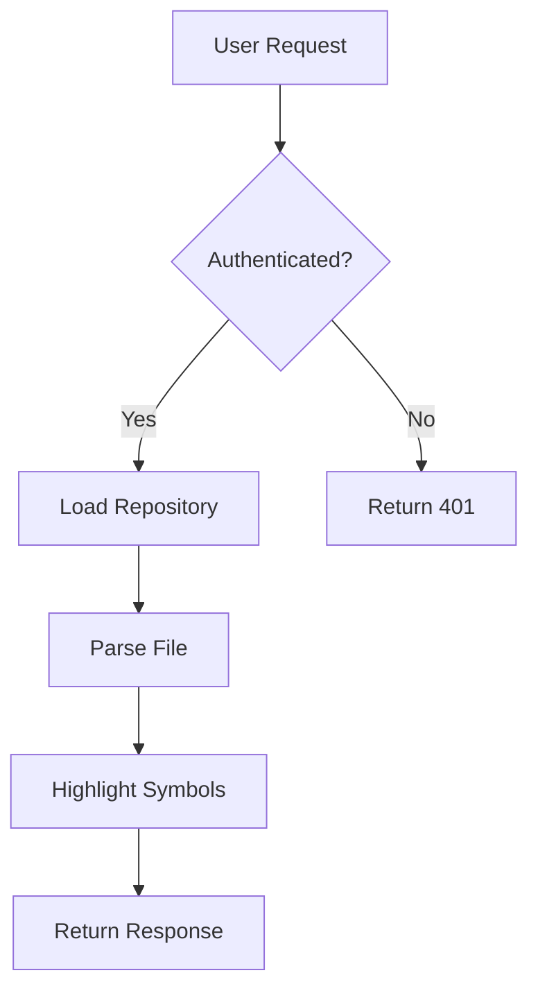
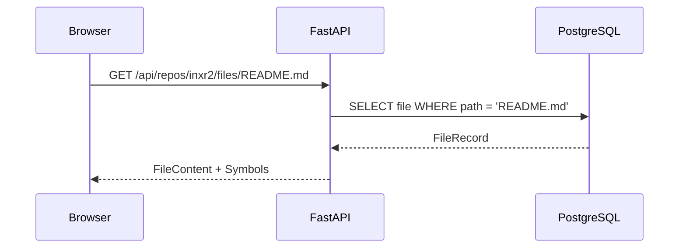
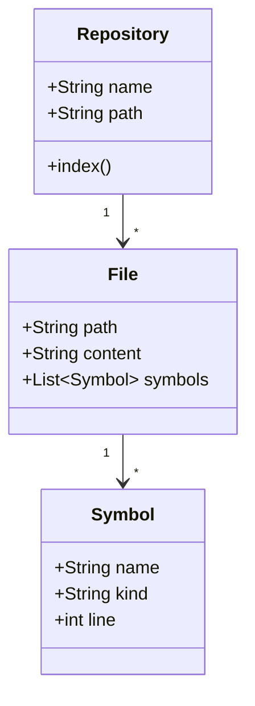
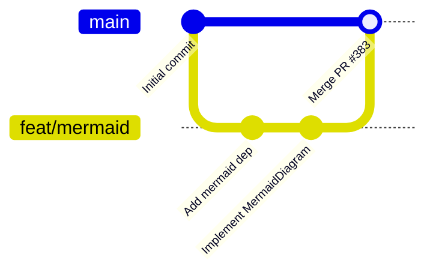

# Mermaid Diagram Test

This file tests mermaid diagram rendering in the INXR2 markdown viewer.

## Flowchart



## Sequence Diagram



## Class Diagram



## Git Graph



## Non-mermaid code block (should use Prism, not mermaid)

```python
def index_repository(repo: Repository) -> IndexResult:
    """Index all files in a repository."""
    symbols = []
    for file in repo.files():
        symbols.extend(parse_symbols(file))
    return IndexResult(symbols=symbols)
```
